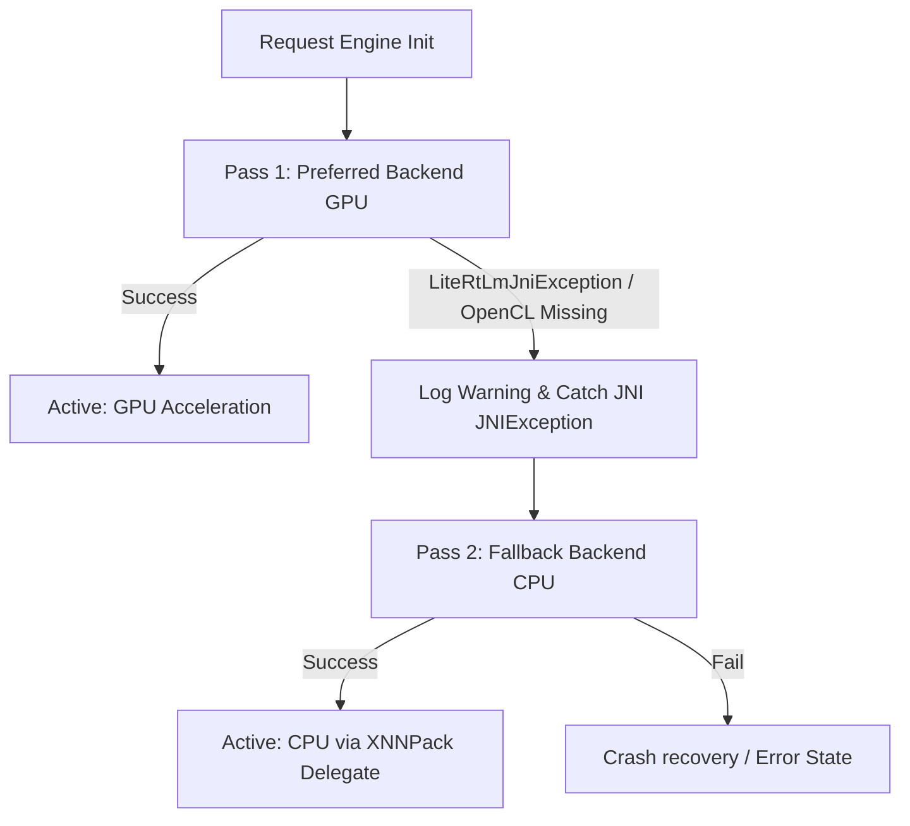

# AI Agent Guide: CodeMateX (Android Code with AI)

Welcome! This guide outlines the project structure, design patterns, core workflows, and critical memory-safety constraints for **CodeMateX** (on-device AI tutoring app). Refer to this document to maintain consistency and prevent native platform regressions.

---

## 1. Project Overview & Architecture
CodeMateX is a native Android application that runs optimized Large Language Models (e.g., Gemma 2B) locally on the user's device using Google's **LiteRT-LM** runtime.

* **Architecture**: Slack's **Circuit** framework (MVI-based Presenter/UI pattern), facilitating clear separation between State, UI Event handlers, and Composable rendering.
* **State Management**: Presenters (like [ChatPresenter](file:///Users/hossain/dev/repos/android-apps/android-code-with-ai/app/src/main/java/dev/hossain/codematex/circuit/ChatPresenter.kt)) yield a state stream that triggers unidirectional UI redraws.
* **Engine Core**: [LlmEngine](file:///Users/hossain/dev/repos/android-apps/android-code-with-ai/app/src/main/java/dev/hossain/codematex/runtime/LlmEngine.kt) interfaces with the native LiteRT-LM runtime wrapper to manage inference loops, system prompting, context restoration, and token extraction.

---

## 2. Critical Memory & JNI Lifecycle Constraints

On-device inference relies heavily on JNI transitions between JVM Kotlin code and C++ native memory allocations. **Violating these constraints will cause immediate segmentation faults (SIGSEGV) or native application crashes.**

### A. Callback Object Retention (JNI GC Race)
* **Rule**: Always retain JNI callback structures (like `MessageCallback` instances passed to `sendMessageAsync`) in a class-level member variable (e.g. `activeCallback` in [LlmEngineImpl](file:///Users/hossain/dev/repos/android-apps/android-code-with-ai/app/src/main/java/dev/hossain/codematex/runtime/LlmEngineImpl.kt)).
* **Rationale**: LiteRT's `sendMessageAsync` runs native background threads. If a callback object is created locally within a suspended coroutine scope, the JVM may garbage-collect the callback instance as soon as the coroutine resumes (returning from the Kotlin method). However, the native C++ thread may still be unwinding the callback call stack. Keeping a class-level strong reference prevents GC until the next message is initiated or cleanup occurs.

### B. Defensively Wrap JNI Inputs
* **Rule**: Wrap token extraction/parsing inside `onMessage` callbacks in defensive `try-catch` blocks.
* **Rationale**: Throwing an unhandled Java/Kotlin exception inside a native-invoked JNI thread results in an immediate native process termination.

### C. Sequential Async Message Seeding
* **Rule**: Ensure async tasks like context/history restoration (`restoreHistory`) are **fully suspended** using `suspendCancellableCoroutine` and block completion until the `onDone()` or `onError()` callback triggers.
* **Rationale**: LiteRT-LM does not support concurrent `sendMessageAsync` execution on the same `Conversation` session. True coroutine suspension prevents the presenter from setting `isPreparing = false` and accepting new inputs while restoration is running, avoiding thread races.

---

## 3. Hardware Initialization & Fallback Strategy

Large Language Models are compute-heavy. To ensure maximum responsiveness while maintaining robustness across a fragmented Android device ecosystem:



* **JNI Exception Handling**: Native LiteRT-LM exceptions throw `com.google.ai.edge.litertlm.LiteRtLmJniException` rather than standard Java runtime exceptions. Catch this specific exception type to trigger sequential fallback loops.
* **OpenGL limitation on Emulator**: Emulators generally lack standard shared-memory virtualization APIs (`CreateSharedMemoryManager`), causing GPU OpenGL delegation to throw errors. The fallback to CPU enables smooth development on emulators.

---

## 4. Sticky Technical Benchmarking Panel

The chat screen contains a sticky benchmarking dashboard right below the top app bar in [ChatScreenUi.kt](file:///Users/hossain/dev/repos/android-apps/android-code-with-ai/app/src/main/java/dev/hossain/codematex/circuit/ChatScreenUi.kt). It provides:
1. **Model Specs**: File size and memory boundaries (e.g. `2588 MB • Requires 4GB RAM`).
2. **Settings**: Sampler settings (`Temp`, `Top-K`, `Top-P`).
3. **Execution Backend**: CPU, GPU, or NPU badge (green-tinted if hardware-accelerated, red-tinted warning if running on CPU).
4. **Real-time Throughput**: Prompt evaluation prefill latency (TTFT) and decode speed in tokens/second (e.g. `TTFT: 514ms • Speed: 12.0 t/s`).

---

## 5. Development Workflows & Commands

* **Compile Code**:
  ```bash
  ./gradlew compileDebugKotlin
  ```
* **Run Unit Tests**:
  ```bash
  ./gradlew test
  ```
* **Format Kotlin Code**:
  ```bash
  ./gradlew formatKotlin
  ```
* **Run Lint and Formatting Checks**:
  ```bash
  ./gradlew check
  ```
