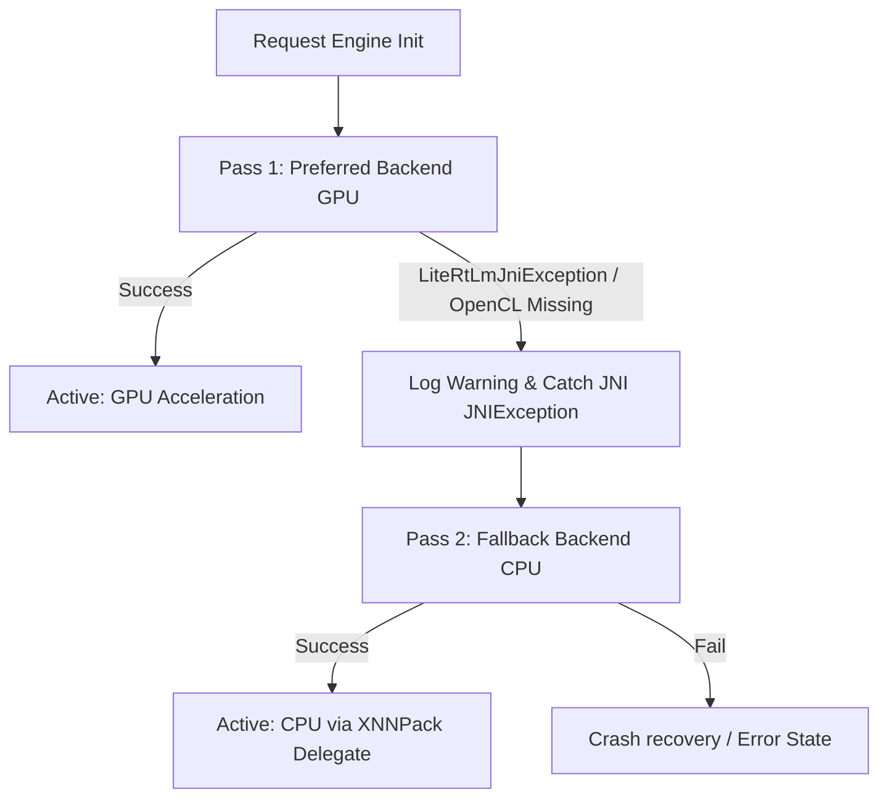

# AI Agent Guide: CodeMateX (Android Code with AI)

Welcome! This guide outlines the project structure, design patterns, core workflows, and critical memory-safety constraints for **CodeMateX** (on-device AI tutoring app). Refer to this document to maintain consistency and prevent native platform regressions.

---

## 1. Project Overview & Architecture
CodeMateX is a native Android application that runs optimized Large Language Models (e.g., Gemma 2B) locally on the user's device using Google's **LiteRT-LM** runtime.

* **Architecture**: Slack's **Circuit** framework (MVI-based Presenter/UI pattern), facilitating clear separation between State, UI Event handlers, and Composable rendering.
* **State Management**: Presenters (like [ChatPresenter](app/src/main/java/dev/hossain/codematex/ui/screens/chat/ChatPresenter.kt)) yield a state stream that triggers unidirectional UI redraws.
* **Engine Core**: [LlmEngine](app/src/main/java/dev/hossain/codematex/runtime/LlmEngine.kt) interfaces with the native LiteRT-LM runtime wrapper to manage inference loops, system prompting, context restoration, and token extraction.

---

## 2. Critical Memory & JNI Lifecycle Constraints

On-device inference relies heavily on JNI transitions between JVM Kotlin code and C++ native memory allocations. **Violating these constraints will cause immediate segmentation faults (SIGSEGV) or native application crashes.**

### A. Callback Object Retention (JNI GC Race)
* **Rule**: Always retain JNI callback structures (like `MessageCallback` instances passed to `sendMessageAsync`) in a class-level member variable (e.g. `activeCallback` in [LlmEngineImpl](app/src/main/java/dev/hossain/codematex/runtime/LlmEngineImpl.kt)).
* **Rationale**: LiteRT's `sendMessageAsync` runs native background threads. If a callback object is created locally within a suspended coroutine scope, the JVM may garbage-collect the callback instance as soon as the coroutine resumes (returning from the Kotlin method). However, the native C++ thread may still be unwinding the callback call stack. Keeping a class-level strong reference prevents GC until the next message is initiated or cleanup occurs.

### B. Defensively Wrap JNI Inputs
* **Rule**: Wrap token extraction/parsing inside `onMessage` callbacks in defensive `try-catch` blocks.
* **Rationale**: Throwing an unhandled Java/Kotlin exception inside a native-invoked JNI thread results in an immediate native process termination.

### C. Sequential Async Message Seeding
* **Rule**: Ensure async tasks like context/history restoration (`restoreHistory`) are **fully suspended** using `suspendCancellableCoroutine` and block completion until the `onDone()` or `onError()` callback triggers.
* **Rationale**: LiteRT-LM does not support concurrent `sendMessageAsync` execution on the same `Conversation` session. True coroutine suspension prevents the presenter from setting `isPreparing = false` and accepting new inputs while restoration is running, avoiding thread races.

---

## 3. Hardware Initialization & Fallback Strategy

Large Language Models are compute-heavy. To ensure maximum responsiveness while maintaining robustness across a fragmented Android device ecosystem:


```mermaid
graph TD
    Start[Request Engine Init] --> TryGPU[Pass 1: Preferred Backend GPU]
    TryGPU -- Success --> LoadedGPU[Active: GPU Acceleration]
    TryGPU -- LiteRtLmJniException / OpenCL Missing --> FailGPU[Log Warning & Catch JNI JNIException]
    FailGPU --> TryCPU[Pass 2: Fallback Backend CPU]
    TryCPU -- Success --> LoadedCPU[Active: CPU via XNNPack Delegate]
    TryCPU -- Fail --> FatalError[Crash recovery / Error State]
```

* **JNI Exception Handling**: Native LiteRT-LM exceptions throw `com.google.ai.edge.litertlm.LiteRtLmJniException` rather than standard Java runtime exceptions. Catch this specific exception type to trigger sequential fallback loops.
* **OpenGL limitation on Emulator**: Emulators generally lack standard shared-memory virtualization APIs (`CreateSharedMemoryManager`), causing GPU OpenGL delegation to throw errors. The fallback to CPU enables smooth development on emulators.

---

## 4. Sticky Technical Benchmarking Panel

The chat screen contains a sticky benchmarking dashboard right below the top app bar in [ChatScreenUi.kt](app/src/main/java/dev/hossain/codematex/ui/screens/chat/ChatScreenUi.kt). It provides:
1. **Model Specs**: File size and memory boundaries (e.g. `2588 MB • Requires 4GB RAM`).
2. **Settings**: Sampler settings (`Temp`, `Top-K`, `Top-P`).
3. **Execution Backend**: CPU, GPU, or NPU badge (green-tinted if hardware-accelerated, red-tinted warning if running on CPU).
4. **Real-time Throughput**: Prompt evaluation prefill latency (TTFT) and decode speed in tokens/second (e.g. `TTFT: 514ms • Speed: 12.0 t/s`).

---

## 5. UI/UX Design System & Adaptive Guidelines

To ensure a modern, premium, and user-friendly experience, CodeMateX strictly adheres to the **Material 3 Expressive** and **Material You Adaptive** design specifications. **Every agent implementing or modifying UI must consult [docs/DESIGN_GUIDELINES.md](docs/DESIGN_GUIDELINES.md) and follow these core rules:**

### A. Material 3 Surface Container Hierarchy
- Use semantic M3 surface containers rather than arbitrary color overrides:
  - `surfaceContainerLow`: Standard cards (`TopicCard`, `SessionCard`, `ModelCard`).
  - `surfaceContainer`: Top app bars, bottom chat input dock, dialog surfaces.
  - `surfaceContainerHigh` / `surfaceContainerHighest`: Hero banners, highlighted benchmarking panels, chips, glyph badges.
- Always provide subtle borders on cards using `BorderStroke(1.dp, MaterialTheme.colorScheme.outlineVariant.copy(alpha = 0.35f))`. (Note: use `Card` with `border`, do NOT use `border` on `ElevatedCard`).

### B. Material You Adaptive Multi-Pane Design
- Never design screens exclusively for compact phones. Always inspect window size class:
  ```kotlin
  val windowSizeClass = currentWindowAdaptiveInfoV2().windowSizeClass
  val isExpanded = windowSizeClass.isWidthAtLeastBreakpoint(WindowSizeClass.WIDTH_DP_MEDIUM_LOWER_BOUND)
  ```
- **Compact (<600dp)**: Single vertical scrolling feed with compact cards and horizontal carousels.
- **Medium & Expanded (>=600dp / Foldables & Tablets)**: Multi-column grid (`GridCells.Adaptive(minSize = 340.dp)`) or 2-pane master-detail layout (360dp left control pane + expanded right content pane).

### C. Atmospheric Jetcaster Lighting & Topic Accents
- Screen scaffolds and hero banners should leverage `Modifier.radialGradientScrim()` from [GradientScrim.kt](app/src/main/java/dev/hossain/codematex/ui/component/GradientScrim.kt).
- Dynamically tint ambient lighting, glyph badges, and borders using the active topic's visual metadata from [TopicTheme.kt](app/src/main/java/dev/hossain/codematex/ui/theme/TopicTheme.kt).

### D. Expressive Tokens & Empty States
- Always use `CircularWavyProgressIndicator` / `LinearWavyProgressIndicator` for loading/streaming states.
- Always provide an expressive empty state with topic glyphs and starter action chips rather than a blank screen.
- Standardize on `pinnedScrollBehavior` attached to both `TopAppBar` and parent `Scaffold.nestedScroll()`.

### E. Mandatory Compose Previews for Modular UI Elements
- **Rule**: Whenever creating or updating composables, screens, or modular UI components, **always include comprehensive `@ThemePreviews` and/or `@DevicePreviews`**.
- **Best Practices**:
  - Wrap preview content in `CodeWithAIAppTheme(dynamicColor = false) { Surface { ... } }` to preview in both Light and Dark modes.
  - Cover multiple critical UI states: nominal/default, preparing/loading, high-load/error, and active states.
  - Ensure standalone modular components (e.g., progress bars, chips, cards) have dedicated previews with realistic sample data and padding.

### F. Markdown Rendering for Chat Messages
- **Library**: Chat/session detail messages are rendered with [multiplatform-markdown-renderer](https://github.com/mikepenz/multiplatform-markdown-renderer) (`v0.44.0`), using the Material 3 (`-m3`) module and syntax highlighting via [compose-highlight](https://github.com/hossain-khan/android-compose-highlight) (`dev.hossain:compose-highlight:0.34.0`).
- **Shared Component**: Use [MarkdownMessage](app/src/main/java/dev/hossain/codematex/ui/component/MarkdownMessage.kt) for all message Markdown. It hoists parsing state with `rememberMarkdownState(content, retainState = true)` so streaming tokens do not flash a loading state.
- **Custom Code Blocks**: Code blocks are intercepted through the library's `markdownComponents(codeBlock = ..., codeFence = ...)` plugin API and rendered with `StreamingSyntaxHighlightedCode` from `dev.hossain.highlight.ui`, providing Highlight.js syntax highlighting with span-transfer preservation, debounced highlighting, line numbers, and copy action.
- **Root Provider**: Wrap UI hierarchy in `HighlightThemeProvider(lightHighlightTheme = rememberTomorrowLightTheme(), darkHighlightTheme = rememberTomorrowNightTheme())` to share a single background engine instance across all message bubbles.
- **Streaming Notes**: The library also provides `StreamingMarkdownState` for append-only token streams. The current presenter emits the full message content on each token, so `rememberMarkdownState` with `retainState = true` is the right fit. If the presenter is refactored to expose raw chunks, migrate to `rememberStreamingMarkdownState()` / `Flow<String>.collectAsStreamingMarkdownState()`.

---

## 6. Development Workflows & Commands

* **Compile Code**:
  ```bash
  ./gradlew compileDebugKotlin
  ```
* **Run Unit Tests**:
  ```bash
  ./gradlew test
  ```
* **Format Kotlin Code**:
  ```bash
  ./gradlew formatKotlin
  ```
* **Run Lint and Formatting Checks**:
  ```bash
  ./gradlew check
  ```

---

## 7. Release Process & Versioning

Whenever preparing or cutting a new application release, **all agents must strictly follow the workflow detailed in [RELEASE.md](RELEASE.md)**:

1. **Branching**: Create `chore/bump-version-X.Y.Z` off `main`.
2. **Version Bump**: Increment `versionCode` by `1` and update `versionName = "X.Y.Z"` in [`app/build.gradle.kts`](app/build.gradle.kts).
3. **Play Store Notes**: Draft user-facing release notes under `project-resources/google-play/release-notes-vX.Y.Z.txt` (**strictly under 500 characters**).
4. **Verification**: Run `./gradlew formatKotlin && ./gradlew check`.
5. **PR & Merge**: Open a PR, merge into `main`, and pull latest `main`.
6. **Tag & Publish**: Create git tag `X.Y.Z` (`git tag X.Y.Z && git push origin X.Y.Z`) and publish a GitHub Release (`gh release create X.Y.Z ...`).
7. **CI/CD Automation**: GitHub Actions ([`.github/workflows/android-release.yml`](.github/workflows/android-release.yml)) will build, sign with the production keystore, cryptographically verify the signature with `apksigner` against the expected SHA-256 certificate fingerprint, and attach the verified release APK & AAB to the release.


