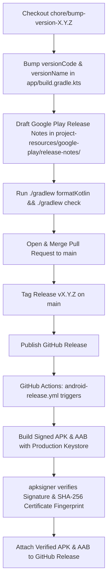

# Release Process Guide: CodeMateX

This document outlines the standard release lifecycle and CI/CD automation workflow for **CodeMateX**. All AI agents and maintainers must follow these steps to ensure consistent versioning, signed binary verification, and smooth Play Store deployment.

---

## 1. Overview & Release Architecture



---

## 2. Step-by-Step Release Procedure

### Step 1: Create a Release Branch
Ensure `main` is up to date and create a dedicated version bump branch:
```bash
git checkout main
git pull --rebase
git checkout -b chore/bump-version-X.Y.Z
```

---

### Step 2: Bump Version in `app/build.gradle.kts`
Open [`app/build.gradle.kts`](app/build.gradle.kts) and update `defaultConfig`:
- Increment `versionCode` by `1` (must always be monotonically increasing for Google Play).
- Set `versionName` to the semantic version string (e.g., `"1.8.0"`).

```kotlin
defaultConfig {
    applicationId = "dev.hossain.codematex"
    minSdk = libs.versions.minSdk.get().toInt()
    targetSdk = libs.versions.targetSdk.get().toInt()
    versionCode = 9          // <-- Increment
    versionName = "1.8.0"    // <-- Set new semantic version
    // ...
}
```

---

### Step 3: Create Google Play Release Notes
Create a new release notes file under [`project-resources/google-play/release-notes/release-notes-vX.Y.Z.txt`](project-resources/google-play/release-notes/).

> [!IMPORTANT]
> **Google Play Console Character Limit**: Release notes must be **strictly under 500 characters** per language.

**Template**:
```text
=== GOOGLE PLAY RELEASE NOTES (Max 500 characters) ===

What's New in vX.Y.Z:
• Feature 1: Description of key user-facing feature.
• Feature 2: Performance or UX improvement.
• Feature 3: Bug fix or architectural optimization.
```

---

### Step 4: Run Code Quality & Verification Checks
Execute formatting and complete test verification locally:
```bash
./gradlew formatKotlin && ./gradlew check
```

Ensure that:
- Spotless Kotlin formatting passes without modifications.
- Android Lint passes with 0 errors.
- All JVM unit tests pass (100% success).
- Kover coverage verification passes.

---

### Step 5: Commit, Push, and Open Pull Request
Commit the version bump and release notes:
```bash
git add app/build.gradle.kts project-resources/google-play/release-notes/release-notes-vX.Y.Z.txt
git commit -m "Bump version to X.Y.Z (versionCode N) with release notes"
git push -u origin chore/bump-version-X.Y.Z
```

Create a Pull Request with `gh pr create`:
```bash
gh pr create \
  --title "Bump version to X.Y.Z (versionCode N) and add release notes" \
  --body "## Summary
Prepares CodeMateX vX.Y.Z (versionCode = N).

### What's Changed:
- Bullet point 1
- Bullet point 2

### Verification:
- Passed ./gradlew formatKotlin && ./gradlew check."
```

---

### Step 6: Merge PR & Sync `main`
Once reviewed and approved:
1. Merge the Pull Request on GitHub.
2. Pull latest `main` locally:
```bash
git checkout main
git pull --rebase
git branch -d chore/bump-version-X.Y.Z
```

---

### Step 7: Tag & Publish Release
Create and push the git tag:
```bash
git tag X.Y.Z
git push origin X.Y.Z
```

Publish the official GitHub Release:
```bash
gh release create X.Y.Z \
  --title "CodeMateX vX.Y.Z" \
  --notes "## What's Changed in vX.Y.Z:
- Summary of improvements
- Bug fixes and optimizations"
```

---

## 3. Automated CI/CD Pipeline (`android-release.yml`)

When a GitHub Release is published, [`.github/workflows/android-release.yml`](.github/workflows/android-release.yml) automatically executes:

1. **Builds Release Binaries**:
   - Compiles `assembleRelease` (producing `app-vX.Y.Z.apk`).
   - Compiles `bundleRelease` (producing `app-vX.Y.Z.aab`).
2. **Signs with Production Keystore**:
   - Decodes base64-encoded release keystore from repository secrets (`RELEASE_KEYSTORE_BASE64`).
3. **Cryptographic Validation**:
   - Runs `apksigner verify --verbose --print-certs` on the generated release APK.
   - Extracts the SHA-256 certificate fingerprint and asserts it strictly matches the production key:
     ```text
     c0547bb27a85df762bf6a96e2f1837c76891eb294efb70f05f778fef1db441e8
     ```
   - Automatically fails the build if signed with a debug certificate or mismatched key.
4. **Artifact Publishing**:
   - Uploads `app-vX.Y.Z.apk` and `app-vX.Y.Z.aab` directly to the GitHub Release.

---

## 4. Release History & Cadence Reference

| Version | `versionCode` | Release Date | Key Highlights |
| :---: | :---: | :---: | :--- |
| `1.19.0` | `38` | 2026-09-03 | Dedicated Guided Courses carousel on Home Screen with one-tap course access; renamed topic section to 'Chat with AI Tutor'; prioritized System Design and Web Development topics; decluttered TopAppBar; upgraded AGP 9.4.0, Gradle 9.6.0, and compose-highlight 0.36.0. |
| `1.18.0` | `37` | 2026-09-02 | Bundled Swift Foundations guided course with 9 chapters, 25 lessons, and interactive Quick Check quizzes; compact code blocks with line numbers off by default; native engine cleanup mutex synchronization preventing cross-thread use-after-free; and automated CI Swift snippet validation. |
| `1.17.5` | `36` | 2026-09-01 | Fixed on-device conversation cancellation latching so interrupting an AI response cleanly resets the conversation handle, enabling follow-up questions without 0-token stalls; hardened native C++ LiteRT-LM conversation lifecycle. |
| `1.17.4` | `35` | 2026-08-31 | Instant zero-resource heuristic chat summarization (< 20ms) eliminating engine mutex contention and background stalls during active chat; proactive native model unloading before memory headroom checks; sequential course lesson backstack navigation. |
| `1.17.3` | `34` | 2026-08-31 | In-memory model reuse when returning to chat from course lessons with 0 MB extra memory allocation; in-context notification permission request for model downloads per Google Play FGS perception policies; Play Console FGS guide. |
| `1.17.2` | `33` | 2026-08-31 | Applied user Code Block Display settings (syntax themes, font size, density preset, line numbers, and language/copy toggles) across all course lesson code blocks. |
| `1.17.1` | `32` | 2026-08-31 | Fixed code block language badge and copy button visibility toggle logic; scrollable empty chat starter prompt cards on compact screens; locked tutor persona picker during active inference; updated LiteRT-LM runtime (0.16.1) and compose-highlight (0.35.0). |
| `1.17.0` | `31` | 2026-08-30 | Centralized Settings screen for AI personas, RAM eviction, Wi-Fi downloads, haptics, and storage; Code Block Customization with live preview (Tomorrow, Atom One, GitHub, Dracula); custom developer profile context injection. |
| `1.16.3` | `30` | 2026-08-29 | First-time user onboarding walkthrough introducing on-device privacy, interactive guided courses & quizzes, and hardware acceleration; community feedback & GitHub issue reporting integration; full edge-to-edge support with safe navigation bar insets; and home title long-press easter egg. |
| `1.16.2` | `29` | 2026-08-29 | System low memory handling & 3-minute background eviction grace timer, pre-flight RAM headroom checks preventing device OOM/LMK kills, on-device LLM runtime debug telemetry screen, and course starter card tap auto-dismissal. |
| `1.16.1` | `28` | 2026-08-28 | Course progress badges (Completed, Current, Upcoming), touch-aware chat auto-scroll pause on drag, and course banner preference persistence. |
| `1.16.0` | `27` | 2026-08-28 | Bundled Interactive Guided Learning Courses (Kotlin, Python, TypeScript, Go, Rust), syntax highlighting with `compose-highlight`, interactive Quick Check quizzes with instant feedback, ephemeral Ask AI Tutor chat, and topic-accented atmospheric radial glow across Home and Course cards. |
| `1.15.1` | `26` | 2026-08-28 | Direct AI answers with silent thought constraints in system prompts, Markdown & streaming code block stability. |
| `1.15.0` | `25` | 2026-08-28 | Syntax-highlighted Markdown code blocks with Highlight.js and line numbers, adaptive top app bar actions, full crash error traces. |
| `1.14.0` | `24` | 2026-08-27 | Fluid 1% model download progress with Compose animation, user chat message long-press copy with haptics, active model TopAppBar subtitle, technical telemetry panel spring animations, and first-time onboarding empty state card. |
| `1.13.1` | `23` | 2026-08-27 | Per-model hyperparameter tuning with animated setting explanations, smooth exit animations across all modal bottom sheets, conditional tune button visibility, and full sheet expansion. |
| `1.13.0` | `22` | 2026-08-27 | Model catalog expansion (Qwen 2.5 Coder 1.5B, Qwen 3 0.6B, Phi-4 Mini), live context usage gauge, silent background downloads, and complete Google Truth 1.4.5 test suite modernization. |
| `1.12.2` | `21` | 2026-08-26 | Binary gigabyte (1024^3) memory precision for device RAM detection and compatibility checks, work package alignment, M3 Markdown heading typography hierarchy, and comprehensive KDoc interface documentation. |
| `1.12.1` | `20` | 2026-08-26 | Multi-tier runtime fallback (NPU -> GPU -> CPU), JNI callback exception isolation, animated responsible AI code disclaimer, idiomatic Kotlin Duration refactoring, and @Immutable Compose stability. |
| `1.12.0` | `19` | 2026-08-26 | LiteRT JNI safety & native lifecycle hardening, atomic model downloads, transactional Room persistence, monotonic TTFT metrics, and Kotlin 2.4 architecture updates. |
| `1.11.0` | `18` | 2026-08-25 | Persistent AI Tutor personas, Jetpack Preferences DataStore, multiplatform-markdown-renderer v0.44.0 with Monospace code blocks, session history animations. |
| `1.10.0` | `17` | 2026-08-25 | Live CPU/RAM telemetry bars during init, UI & test package reorganization, Codecov Test Analytics. |
| `1.9.3` | `16` | 2026-08-25 | Smart auto-scroll with Jump-to-Bottom pill, download complete notifications, R8 size optimization. |
| `1.9.2` | `15` | 2026-08-24 | Room database v2 schema migration (messageId) for stable chat scrolling, Mutex synchronization in LlmEngineImpl preventing native thread races, compose @ThemePreviews/@DevicePreviews across all screens, and asymmetric chat bubbles. |
| `1.9.1` | `14` | 2026-08-23 | Streamlined AI Tutor Personas (Senior Architect, Beginner Tutor, Interview Coach), friendly model display names, real-time throughput metrics (TTFT, decode speed) in technical benchmarking panel, and tuned default prompting. |
| `1.9.0` | `10` | 2026-08-24 | Hardware benchmark scorecard, model config sheet, download cancel/delete management. |
| `1.8.3` | `12` | 2026-08-23 | Initialization safety preventing sending messages while models are preparing, clean single-line ModelCard headers, and model deletion confirmation dialog polish. |
| `1.8.2` | `11` | 2026-08-23 | Model deletion and device storage recovery with confirmation dialogs, active model highlight badges, model-named download notifications with deep linking (codematex://models), and reactive repository flows. |
| `1.8.1` | `10` | 2026-08-23 | Chat initialization coroutine lifecycle fix, zero memory buffering for multi-gigabyte downloads, manual stop preserving hardware acceleration without CPU fallback, and M3 retry error container. |
| `1.8.0` | `9` | 2026-08-23 | Background download service with WorkManager, sticky notifications, foreground download progress. |
| `1.7.0` | `8` | 2026-08-22 | SOLID architecture refactor (P1-P6), HTTP range downloader, JNI safety, M3 input dock. |
| `1.6.0` | `7` | 2026-08-21 | Production release keystore enforcement, initial Google Play release notes, Markdown chat typography. |
| `1.5.0` | `6` | 2026-08-20 | Atmospheric M3 Jetcaster redesign, multi-pane adaptive layouts, wavy progress indicators. |
| `1.4.0` | `5` | 2026-08-19 | On-device LiteRT-LM runtime integration, Gemma 2B/4B model allowlist. |
