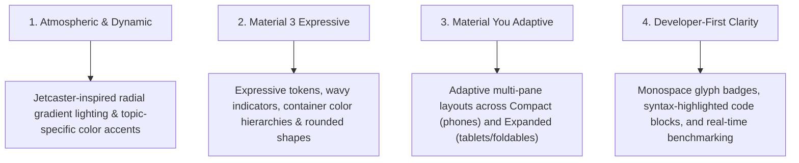

# CodeMateX Design System & UI/UX Guidelines

Welcome to the **CodeMateX Design Language Specification**. This document establishes the design principles, color hierarchies, typography standards, component patterns, and adaptive layout rules for the CodeMateX Android app.

**Every AI agent and developer adding new screens, composables, or modifying existing UI MUST adhere to these guidelines.**

---

## 1. Core Design Pillars



1. **Atmospheric & Dynamic Lighting**:
   - Screens and hero components feature smooth top-center radial gradient lighting inspired by Google's Jetcaster sample (`Modifier.radialGradientScrim()`).
   - Each coding topic dynamically tints its background glow, badges, and accents.
2. **Material 3 Expressive Tokens**:
   - Standardize on Material 3 Expressive components (`CircularWavyProgressIndicator`, `LinearWavyProgressIndicator`, `FilledTonalButton`).
   - Strictly follow M3 surface container roles (`surfaceContainerLow`, `surfaceContainer`, `surfaceContainerHigh`, `surfaceContainerHighest`).
3. **Material You Adaptive Multi-Pane Layouts**:
   - Mobile-first, but natively responsive. Single-column on compact phones, multi-column and 2-pane master-detail on foldables and tablets.
4. **Developer-Centric Precision**:
   - Clean monospace typography for code and glyphs (`KT`, `UI`, `ALG`, `BUG`), high-contrast syntax highlighting, and dedicated copy-to-clipboard interactions.

---

## 2. Color System & Surface Container Hierarchy

CodeMateX uses Material 3 dynamic color palettes with defined surface container tiers to establish visual hierarchy without heavy drop shadows.

### Surface Container Tier Rules

| Role | Token | Usage Example |
| :--- | :--- | :--- |
| **Base Canvas** | `MaterialTheme.colorScheme.surface` | Background of the screen scaffold |
| **Lowest Container** | `MaterialTheme.colorScheme.surfaceContainerLowest` | Inset content panels, code editor backgrounds |
| **Low Container** | `MaterialTheme.colorScheme.surfaceContainerLow` | Standard cards (`TopicCard`, `SessionCard`, `ModelCard`), unselected state |
| **Default Container** | `MaterialTheme.colorScheme.surfaceContainer` | Top app bars, bottom chat input dock, modal sheets |
| **High Container** | `MaterialTheme.colorScheme.surfaceContainerHigh` | Hero banners, highlighted benchmarking panels, active selected cards |
| **Highest Container** | `MaterialTheme.colorScheme.surfaceContainerHighest` | Chip pills, badges, secondary pill buttons, metadata tags |

### Topic Visual Identity & Dynamic Accents

Every coding topic defined in [`CodingTopic.kt`](../app/src/main/java/dev/hossain/codematex/data/model/CodingTopic.kt) has visual metadata in [`TopicTheme.kt`](../app/src/main/java/dev/hossain/codematex/ui/theme/TopicTheme.kt):

```kotlin
val visualInfo = topic.visualInfo
// visualInfo.accentColor  -> High-visibility topic theme color
// visualInfo.iconGlyph    -> 2-4 character monospace badge (e.g. "KT", "UI", "ALG")
// visualInfo.tagline      -> Engaging subtitle
// visualInfo.starterPrompts -> Interactive prompt suggestions
```

### Ambient Gradient Scrims ([GradientScrim.kt](../app/src/main/java/dev/hossain/codematex/ui/component/GradientScrim.kt))

Use radial gradient scrims on screen scaffolds and hero banners:
```kotlin
Scaffold(
    modifier = modifier
        .nestedScroll(scrollBehavior.nestedScrollConnection)
        .radialGradientScrim(visualInfo.accentColor.copy(alpha = 0.15f))
) { ... }
```

---

## 3. Typography & Shapes

### Typography Guidelines
- **Headlines & App Titles**: `MaterialTheme.typography.titleLarge` or `headlineSmall` with `FontWeight.Bold` / `FontWeight.ExtraBold`.
- **Topic Monospace Glyphs**: `FontFamily.Monospace` with `FontWeight.Bold` and `MaterialTheme.typography.labelSmall` inside rounded badges.
- **Body & Explanations**: `MaterialTheme.typography.bodyMedium` with `MaterialTheme.colorScheme.onSurface`.
- **Secondary Metadata**: `MaterialTheme.typography.bodySmall` / `labelSmall` with `MaterialTheme.colorScheme.onSurfaceVariant` or `outline`.

### Shape System
- **Cards & Hero Banners**: `MaterialTheme.shapes.large` (16.dp) or `extraLarge` (28.dp) with subtle 1.dp border (`BorderStroke(1.dp, MaterialTheme.colorScheme.outlineVariant.copy(alpha = 0.35f))`).
- **Pills & Glyphs**: `MaterialTheme.shapes.extraSmall` (4.dp) or `small` (8.dp).
- **Action Buttons & Avatar Icons**: `CircleShape` or `MaterialTheme.shapes.large`.
- **Asymmetric Message Bubbles**:
  - User bubble: `RoundedCornerShape(topStart = 18.dp, topEnd = 18.dp, bottomStart = 18.dp, bottomEnd = 4.dp)`
  - Assistant bubble: `RoundedCornerShape(topStart = 18.dp, topEnd = 18.dp, bottomStart = 4.dp, bottomEnd = 18.dp)`

---

## 4. Material You Adaptive Multi-Pane Architecture

CodeMateX supports phones, foldables, tablets, and landscape orientations using AndroidX Window Size Classes:

```kotlin
@OptIn(ExperimentalMaterial3AdaptiveApi::class)
val windowSizeClass = currentWindowAdaptiveInfoV2().windowSizeClass
val isExpanded = windowSizeClass.isWidthAtLeastBreakpoint(WindowSizeClass.WIDTH_DP_MEDIUM_LOWER_BOUND)
```

### Adaptive Layout Rules

| Screen Size | Breakpoint | Layout Strategy |
| :--- | :--- | :--- |
| **Compact (Phone Portrait)** | `< 600dp` width | Single vertical scrolling column with horizontal carousels for secondary items |
| **Medium (Foldables, Small Tablets)** | `600dp - 840dp` width | 2-column layout or adaptive grid (`GridCells.Adaptive(minSize = 340.dp)`) |
| **Expanded (Large Tablets, Desktop)** | `>= 840dp` width | Multi-pane layout: Master sidebar / Left controls (360dp width) + Main content right pane |

---

## 5. Standard Component Patterns

### A. Top App Bar & Nested Scroll
Always attach `pinnedScrollBehavior` to both `TopAppBar` and parent `Scaffold`:
```kotlin
val scrollBehavior = TopAppBarDefaults.pinnedScrollBehavior()

Scaffold(
    modifier = modifier.nestedScroll(scrollBehavior.nestedScrollConnection),
    topBar = {
        TopAppBar(
            title = { Text("Screen Title", fontWeight = FontWeight.Bold) },
            scrollBehavior = scrollBehavior,
        )
    },
) { innerPadding ->
    // Always apply innerPadding to the root scrollable container
}
```

### B. Progress Indicators (Material 3 Expressive)
- Use `CircularWavyProgressIndicator()` for indeterminate loading.
- Use `LinearWavyProgressIndicator(progress = { progressFloat })` for downloads and determinate progress.

### C. Cards with Borders
When creating cards with containers, always use `Card` or `OutlinedCard` with explicit `border` (do NOT use `border` on `ElevatedCard`):
```kotlin
Card(
    modifier = modifier.fillMaxWidth(),
    shape = MaterialTheme.shapes.large,
    colors = CardDefaults.cardColors(
        containerColor = MaterialTheme.colorScheme.surfaceContainerLow,
    ),
    border = BorderStroke(1.dp, MaterialTheme.colorScheme.outlineVariant.copy(alpha = 0.35f)),
) { ... }
```

### D. Empty States
Every screen with dynamic lists MUST include an expressive empty state:
- Icon or Topic Monospace Glyph in a circular tinted surface.
- Clear title and explanatory subtitle.
- Interactive prompt chips or primary action button.

### E. Markdown Rendering & Code Blocks
LLM responses are rendered in native Compose using **`compose-richtext`** ([github.com/halilozercan/compose-richtext](https://github.com/halilozercan/compose-richtext)):
- **Artifacts**: `com.halilibo.compose-richtext:richtext-commonmark` & `richtext-ui-material3` (CommonMark AST parser).
- **Typography Sizing**: Scaled to ensure high readability within compact mobile chat bubbles:
  - Base body text: `MaterialTheme.typography.bodyMedium` (`14.sp`, `20.sp` line height).
  - Headings (H1–H6): Scaled proportionally (H1: `16.sp Bold`, H2: `15.sp Bold`, H3: `14.5.sp SemiBold`).
  - Code Blocks: Monospace `12.5.sp` with `surfaceContainerLowest` container background and rounded 8.dp corners.
  - Spacing: Compact `paragraphSpacing = 6.sp`.

---

## 6. AI Agent Implementation Checklist

Before finishing any UI task, verify the following checklist:

- [ ] **M3 Surface Container Hierarchy**: Are cards using `surfaceContainerLow` and top/bottom bars using `surfaceContainer`?
- [ ] **Adaptive Layout**: Is the screen responsive using `currentWindowAdaptiveInfoV2()`?
- [ ] **Wavy Progress**: Are loading states using `CircularWavyProgressIndicator` / `LinearWavyProgressIndicator`?
- [ ] **Atmospheric Glow**: Is `radialGradientScrim` applied where appropriate?
- [ ] **Empty States**: Are empty lists handled gracefully with informative visuals?
- [ ] **Formatting & Checks**: Did you run `./gradlew formatKotlin` and `./gradlew check`?
