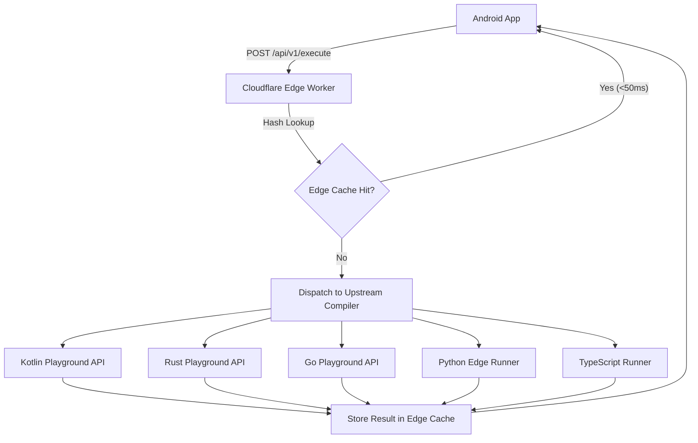

# Edge Code Playground Proxy: Android Integration Guide

This guide details how any Android application can integrate with the **Edge Code Playground Proxy microservice** (`https://code-playground.gohk.xyz`). It provides drop-in data models, Retrofit service definitions, repository abstractions, network configurations, and UI recipes to enable online code execution in minutes.

---

## 1. Overview & Architecture

Modern developer tools, tutoring applications, and learning platforms often need to run arbitrary code snippets across multiple programming languages. However, calling individual upstream compilers (like the Kotlin Playground, Rust Playground, or Go Playground) directly from a mobile client introduces significant issues:
- **Fragmented APIs**: Every language compiler has its own proprietary JSON schema, endpoint paths, and error formats.
- **Latency & Reliability**: Mobile clients experience unpredictable latency on mobile networks when contacting different global server endpoints.
- **No Caching**: Upstream compilers recompile duplicate code snippets repeatedly, wasting battery and data.

### The Solution: Edge Playground Proxy
The Edge Code Playground Proxy is a lightweight serverless microservice hosted on **Cloudflare Workers**. It unifies multi-language compilation behind a single, consistent REST API with global edge caching and DDoS protection:



### Key Capabilities
- **Global Edge Caching**: Identical snippets return in `<50ms` from Cloudflare's global edge network.
- **Multi-Language Support**: Single endpoint handles **Kotlin**, **Go**, **Python**, **Rust**, and **TypeScript**.
- **Standardized Errors**: Unifies compiler diagnostics, syntax errors, and runtime panics into a single, structured response format.
- **Timeout Protection**: Enforces server-side compilation limits to prevent client hangs.

---

## 2. API Specification

### Endpoint
```http
POST https://code-playground.gohk.xyz/api/v1/execute
```

### HTTP Request Headers
| Header | Required | Description | Example |
| :--- | :---: | :--- | :--- |
| `Content-Type` | **Yes** | Payload format | `application/json` |
| `X-Client-Id` | No | Client application identifier for tracking and analytics | `MyApp-Android` |
| `Authorization` | No | Bearer authentication token (if required or configured) | `Bearer <TOKEN>` |

### Request Body (`PlaygroundExecuteRequest`)
```json
{
  "language": "kotlin",
  "code": "fun main() {\n    println(\"Hello, World!\")\n}",
  "version": "stable",
  "edition": null,
  "optimize": "0",
  "args": [],
  "bypassCache": false
}
```

| Field | Type | Default | Description |
| :--- | :---: | :---: | :--- |
| `language` | `String` | *(Required)* | Language identifier: `"kotlin"`, `"go"`, `"python"`, `"rust"`, or `"typescript"`. |
| `code` | `String` | *(Required)* | Full source code of the program to compile and run. |
| `version` | `String` | `"stable"` | Compiler release channel (`"stable"`, `"beta"`, `"nightly"`). |
| `edition` | `String?` | `null` | Language edition. **Required for Rust** (e.g. `"2021"`). |
| `optimize` | `String` | `"0"` | Optimization level flag (e.g. `"0"`, `"1"`, `"2"`, `"3"`). |
| `args` | `List<String>` | `[]` | Optional command-line arguments to pass to the compiled binary. |
| `bypassCache` | `Boolean` | `false` | When `true`, forces fresh execution by skipping edge cache. |

### Response Body (`PlaygroundExecuteResponse`)
```json
{
  "status": "success",
  "language": "kotlin",
  "version": "2.1.0",
  "output": "Hello, World!\n",
  "error": null,
  "cached": true,
  "executionTimeMs": 42,
  "timestamp": 1726162800000
}
```

| Field | Type | Description |
| :--- | :---: | :--- |
| `status` | `String` | Execution status: `"success"`, `"compilation_error"`, `"runtime_error"`, `"upstream_timeout"`, `"unsupported_language"`, `"rate_limited"`, `"unauthorized"`, or `"error"`. |
| `language` | `String?` | The language processed by the runner. |
| `version` | `String?` | Compiler version used for execution. |
| `output` | `String` | Standard output (stdout) produced by the program. Empty if no output or on compilation failure. |
| `error` | `String?` | Compiler diagnostic messages, syntax error traces, or server exception details. |
| `cached` | `Boolean` | `true` if the response was served from Cloudflare's global edge cache (<50ms). |
| `executionTimeMs` | `Long` | Execution/compilation duration in milliseconds. |
| `timestamp` | `Long` | Server-side execution Unix timestamp in milliseconds. |

---

## 3. Supported Languages & Starter Templates

| Language | Identifiers | Rust Edition | Sample Code |
| :--- | :--- | :---: | :--- |
| **Kotlin** | `"kotlin"`, `"kt"` | N/A | `fun main() { println("Hello from Kotlin!") }` |
| **Go** | `"go"`, `"golang"` | N/A | `package main\nimport "fmt"\nfunc main() { fmt.Println("Hello from Go!") }` |
| **Python** | `"python"`, `"py"`, `"python3"` | N/A | `print("Hello from Python!")\nprint(list(range(5)))` |
| **Rust** | `"rust"`, `"rs"` | `"2021"` | `fn main() { println!("Hello from Rust!"); }` |
| **TypeScript** | `"typescript"`, `"ts"` | N/A | `const msg: string = "Hello from TS"; console.log(msg);` |

---

## 4. Technical Models & Service Classes (Drop-in Ready)

To integrate this in another Android app with **minimal effort**, copy the following files into your project.

### Step 1: Gradle Dependencies
Add Retrofit, OkHttp, and Kotlinx Serialization to your `app/build.gradle.kts`:

```kotlin
dependencies {
    // Network & Serialization
    implementation("com.squareup.retrofit2:retrofit:2.11.0")
    implementation("com.squareup.okhttp3:okhttp:4.12.0")
    implementation("com.squareup.okhttp3:logging-interceptor:4.12.0")
    implementation("org.jetbrains.kotlinx:kotlinx-serialization-json:1.7.3")
    implementation("com.jakewharton.retrofit:retrofit2-kotlinx-serialization-converter:1.0.0")

    // Coroutines
    implementation("org.jetbrains.kotlinx:kotlinx-coroutines-android:1.9.0")
}
```

### Step 2: DTOs (`PlaygroundDto.kt`)
These data transfer objects map 1:1 with the microservice request and response:

```kotlin
package com.example.app.data.remote

import kotlinx.serialization.EncodeDefault
import kotlinx.serialization.ExperimentalSerializationApi
import kotlinx.serialization.Serializable

@OptIn(ExperimentalSerializationApi::class)
@Serializable
data class PlaygroundExecuteRequest(
    val language: String,
    val code: String,
    @EncodeDefault val version: String = "stable",
    val edition: String? = null,
    @EncodeDefault val optimize: String = "0",
    @EncodeDefault val args: List<String> = emptyList(),
    @EncodeDefault val bypassCache: Boolean = false,
)

@Serializable
data class PlaygroundExecuteResponse(
    val status: String,
    val language: String? = null,
    val version: String? = null,
    val output: String = "",
    val error: String? = null,
    val cached: Boolean = false,
    val executionTimeMs: Long = 0,
    val timestamp: Long = 0,
)
```

### Step 3: Retrofit Service Interface (`PlaygroundProxyApi.kt`)
```kotlin
package com.example.app.data.remote

import retrofit2.http.Body
import retrofit2.http.POST

interface PlaygroundProxyApi {
    @POST("api/v1/execute")
    suspend fun execute(
        @Body request: PlaygroundExecuteRequest,
    ): PlaygroundExecuteResponse
}
```

### Step 4: Domain Result Model (`PlaygroundExecutionResult.kt`)
A sealed interface that isolates HTTP and API codes from your presentation layer:

```kotlin
package com.example.app.domain.runner

sealed interface PlaygroundExecutionResult {
    /** Code executed successfully. [output] contains program stdout. */
    data class Success(
        val output: String,
        val isCached: Boolean = false,
        val executionTimeMs: Long = 0,
    ) : PlaygroundExecutionResult

    /** Compilation, syntax, or runtime error. [diagnostic] contains the compiler trace. */
    data class CompilationError(
        val diagnostic: String,
    ) : PlaygroundExecutionResult

    /** Network drop, timeout, rate limit, or server fault. [message] is user-facing. */
    data class NetworkError(
        val message: String,
    ) : PlaygroundExecutionResult
}
```

### Step 5: Service Runner Implementation (`EdgePlaygroundCodeRunner.kt`)
This class provides:
- Automatic language alias normalization (e.g. `rs` -> `rust`, `kt` -> `kotlin`).
- Default Rust edition tagging (`2021`).
- Network liveness checking to fail fast when offline.
- Detailed error body extraction from HTTP error codes.
- Timeout protection (`SocketTimeoutException`).

```kotlin
package com.example.app.domain.runner

import android.content.Context
import android.net.ConnectivityManager
import android.net.NetworkCapabilities
import com.example.app.data.remote.PlaygroundExecuteRequest
import com.example.app.data.remote.PlaygroundProxyApi
import java.io.IOException
import java.net.SocketTimeoutException

interface PlaygroundCodeRunner {
    fun supports(language: String): Boolean
    suspend fun runSnippet(code: String, language: String, bypassCache: Boolean = false): PlaygroundExecutionResult
}

class EdgePlaygroundCodeRunner(
    private val api: PlaygroundProxyApi,
    private val context: Context,
) : PlaygroundCodeRunner {

    override fun supports(language: String): Boolean =
        when (language.trim().lowercase()) {
            "rust", "rs",
            "kotlin", "kt",
            "go", "golang",
            "python", "py", "python3",
            "typescript", "ts",
            -> true
            else -> false
        }

    override suspend fun runSnippet(
        code: String,
        language: String,
        bypassCache: Boolean,
    ): PlaygroundExecutionResult {
        val normalizedLang = language.trim().lowercase()
        if (!supports(normalizedLang)) {
            return PlaygroundExecutionResult.NetworkError("Language '$language' is not supported.")
        }

        if (!isNetworkOnline()) {
            return PlaygroundExecutionResult.NetworkError("Internet connection required to run code.")
        }

        return try {
            val edition = if (normalizedLang == "rust" || normalizedLang == "rs") "2021" else null
            val response = api.execute(
                PlaygroundExecuteRequest(
                    language = normalizedLang,
                    code = code,
                    edition = edition,
                    bypassCache = bypassCache,
                )
            )

            when (response.status) {
                "success" -> {
                    val output = response.output.trimEnd().ifEmpty { "Program executed with no output." }
                    PlaygroundExecutionResult.Success(
                        output = output,
                        isCached = response.cached,
                        executionTimeMs = response.executionTimeMs,
                    )
                }

                "compilation_error", "runtime_error" -> {
                    val diagnostic = response.error?.trim().orEmpty()
                    PlaygroundExecutionResult.CompilationError(
                        diagnostic.ifEmpty { "Execution failed with status: ${response.status}" }
                    )
                }

                "rate_limited" -> {
                    PlaygroundExecutionResult.NetworkError("Rate limit exceeded. Please wait a moment.")
                }

                "upstream_timeout" -> {
                    PlaygroundExecutionResult.NetworkError("Execution timed out on the upstream compiler.")
                }

                "unauthorized" -> {
                    PlaygroundExecutionResult.NetworkError("Unauthorized playground request.")
                }

                else -> {
                    val message = response.error?.trim().orEmpty()
                    PlaygroundExecutionResult.NetworkError(message.ifEmpty { "Error: ${response.status}" })
                }
            }
        } catch (_: SocketTimeoutException) {
            PlaygroundExecutionResult.NetworkError("Request timed out. The playground took too long to respond.")
        } catch (e: retrofit2.HttpException) {
            val errorBody = e.response()?.errorBody()?.string()?.trim()
            val message = if (!errorBody.isNullOrEmpty()) "Playground error (${e.code()}): $errorBody" else "HTTP ${e.code()}"
            PlaygroundExecutionResult.NetworkError(message)
        } catch (_: IOException) {
            PlaygroundExecutionResult.NetworkError("Network error: Unable to reach the playground server.")
        } catch (e: Exception) {
            PlaygroundExecutionResult.NetworkError(e.message ?: "An unexpected error occurred.")
        }
    }

    private fun isNetworkOnline(): Boolean {
        val cm = context.getSystemService(Context.CONNECTIVITY_SERVICE) as? ConnectivityManager ?: return true
        val network = cm.activeNetwork ?: return false
        val caps = cm.getNetworkCapabilities(network) ?: return false
        return caps.hasCapability(NetworkCapabilities.NET_CAPABILITY_INTERNET) &&
            caps.hasCapability(NetworkCapabilities.NET_CAPABILITY_VALIDATED)
    }
}
```

---

## 5. Dependency Injection & Client Setup

### Option A: Standalone Factory (No DI Framework)
If you do not use Dagger, Hilt, or Koin, initialize the runner directly:

```kotlin
import android.content.Context
import com.jakewharton.retrofit2.converter.kotlinx.serialization.asConverterFactory
import kotlinx.serialization.json.Json
import okhttp3.MediaType.Companion.toMediaType
import okhttp3.OkHttpClient
import retrofit2.Retrofit
import java.util.concurrent.TimeUnit

object PlaygroundClientFactory {
    fun create(context: Context, authToken: String? = null): PlaygroundCodeRunner {
        val json = Json {
            ignoreUnknownKeys = true
            isLenient = true
            encodeDefaults = true
            explicitNulls = false
        }

        val okHttpClient = OkHttpClient.Builder()
            .connectTimeout(30, TimeUnit.SECONDS)
            .readTimeout(30, TimeUnit.SECONDS)
            .addInterceptor { chain ->
                val builder = chain.request().newBuilder()
                    .header("X-Client-Id", "${context.packageName}-Android")
                if (!authToken.isNullOrBlank()) {
                    builder.header("Authorization", "Bearer $authToken")
                }
                chain.proceed(builder.build())
            }
            .build()

        val api = Retrofit.Builder()
            .baseUrl("https://code-playground.gohk.xyz/")
            .client(okHttpClient)
            .addConverterFactory(json.asConverterFactory("application/json".toMediaType()))
            .build()
            .create(PlaygroundProxyApi::class.java)

        return EdgePlaygroundCodeRunner(api, context.applicationContext)
    }
}
```

### Option B: Hilt / Dagger Module
```kotlin
@Module
@InstallIn(SingletonComponent::class)
object PlaygroundNetworkModule {

    @Provides
    @Singleton
    fun providePlaygroundJson(): Json = Json {
        ignoreUnknownKeys = true
        isLenient = true
        encodeDefaults = true
        explicitNulls = false
    }

    @Provides
    @Singleton
    fun providePlaygroundApi(
        @ApplicationContext context: Context,
        json: Json,
    ): PlaygroundProxyApi {
        val client = OkHttpClient.Builder()
            .connectTimeout(30, TimeUnit.SECONDS)
            .readTimeout(30, TimeUnit.SECONDS)
            .addInterceptor { chain ->
                val request = chain.request().newBuilder()
                    .header("X-Client-Id", "${context.packageName}-Android")
                    .build()
                chain.proceed(request)
            }
            .build()

        return Retrofit.Builder()
            .baseUrl("https://code-playground.gohk.xyz/")
            .client(client)
            .addConverterFactory(json.asConverterFactory("application/json".toMediaType()))
            .build()
            .create(PlaygroundProxyApi::class.java)
    }

    @Provides
    @Singleton
    fun providePlaygroundCodeRunner(
        api: PlaygroundProxyApi,
        @ApplicationContext context: Context,
    ): PlaygroundCodeRunner = EdgePlaygroundCodeRunner(api, context)
}
```

---

## 6. Jetpack Compose UI Example

Here is a ready-to-use Composable card that executes a snippet and renders stdout or compiler errors with execution telemetry:

```kotlin
@Composable
fun CodeRunnerCard(
    code: String,
    language: String,
    codeRunner: PlaygroundCodeRunner,
    modifier: Modifier = Modifier,
) {
    val scope = rememberCoroutineScope()
    var isRunning by remember { mutableStateOf(false) }
    var result by remember { mutableStateOf<PlaygroundExecutionResult?>(null) }

    Card(
        modifier = modifier.fillMaxWidth(),
        shape = MaterialTheme.shapes.medium,
        colors = CardDefaults.cardColors(containerColor = MaterialTheme.colorScheme.surfaceContainerLow),
    ) {
        Column(modifier = Modifier.padding(16.dp), verticalArrangement = Arrangement.spacedBy(12.dp)) {
            Row(
                modifier = Modifier.fillMaxWidth(),
                horizontalArrangement = Arrangement.SpaceBetween,
                verticalAlignment = Alignment.CenterVertically,
            ) {
                Text(
                    text = "Runner: ${language.uppercase()}",
                    style = MaterialTheme.typography.titleSmall,
                    fontWeight = FontWeight.Bold,
                )

                Button(
                    onClick = {
                        scope.launch {
                            isRunning = true
                            result = codeRunner.runSnippet(code, language)
                            isRunning = false
                        }
                    },
                    enabled = !isRunning,
                ) {
                    if (isRunning) {
                        CircularProgressIndicator(modifier = Modifier.size(16.dp), strokeWidth = 2.dp)
                        Spacer(modifier = Modifier.width(8.dp))
                        Text("Running...")
                    } else {
                        Icon(Icons.Default.PlayArrow, contentDescription = null, modifier = Modifier.size(16.dp))
                        Spacer(modifier = Modifier.width(4.dp))
                        Text("Run Code")
                    }
                }
            }

            // Output Terminal Area
            result?.let { res ->
                val (bgColor, textColor) = when (res) {
                    is PlaygroundExecutionResult.Success -> MaterialTheme.colorScheme.surfaceContainerHighest to MaterialTheme.colorScheme.onSurface
                    is PlaygroundExecutionResult.CompilationError -> MaterialTheme.colorScheme.errorContainer to MaterialTheme.colorScheme.onErrorContainer
                    is PlaygroundExecutionResult.NetworkError -> MaterialTheme.colorScheme.errorContainer.copy(alpha = 0.5f) to MaterialTheme.colorScheme.onErrorContainer
                }

                Surface(
                    shape = MaterialTheme.shapes.small,
                    color = bgColor,
                    modifier = Modifier.fillMaxWidth(),
                ) {
                    Column(modifier = Modifier.padding(12.dp)) {
                        when (res) {
                            is PlaygroundExecutionResult.Success -> {
                                if (res.isCached) {
                                    Text(
                                        text = "⚡ Cached Result (<50ms)",
                                        style = MaterialTheme.typography.labelSmall,
                                        color = MaterialTheme.colorScheme.primary,
                                        fontWeight = FontWeight.Bold,
                                    )
                                    Spacer(modifier = Modifier.height(4.dp))
                                }
                                Text(
                                    text = res.output,
                                    fontFamily = FontFamily.Monospace,
                                    style = MaterialTheme.typography.bodySmall,
                                    color = textColor,
                                )
                            }
                            is PlaygroundExecutionResult.CompilationError -> {
                                Text(
                                    text = "Compilation / Diagnostic Error:",
                                    style = MaterialTheme.typography.labelSmall,
                                    color = MaterialTheme.colorScheme.error,
                                    fontWeight = FontWeight.Bold,
                                )
                                Spacer(modifier = Modifier.height(4.dp))
                                Text(
                                    text = res.diagnostic,
                                    fontFamily = FontFamily.Monospace,
                                    style = MaterialTheme.typography.bodySmall,
                                    color = textColor,
                                )
                            }
                            is PlaygroundExecutionResult.NetworkError -> {
                                Text(
                                    text = "Error: ${res.message}",
                                    style = MaterialTheme.typography.bodySmall,
                                    color = textColor,
                                )
                            }
                        }
                    }
                }
            }
        }
    }
}
```

---

## 7. Critical Best Practices & Pitfalls

### ⚠️ Warning on OkHttp Logging Interceptor
> [!WARNING]
> If your `OkHttpClient` is shared with large file downloads (e.g. on-device AI model weights or media files), **DO NOT use `HttpLoggingInterceptor.Level.BODY`**. `Level.BODY` buffers the full payload in RAM (`okio.Buffer`), which will immediately throw an `OutOfMemoryError` on large responses. Use `Level.HEADERS` in debug builds.

### ⚡ Global Edge Caching Strategy
The Cloudflare proxy hashes `(language, code, edition, args)` as the cache key.
- Identical code snippets execute instantly (`<50ms`).
- Set `bypassCache = true` if the code depends on non-deterministic behavior (like `System.currentTimeMillis()` or random seeds) and you require fresh upstream execution.

### ⏱ Timeout Management
Some upstream compilers (notably Rust and Go) occasionally incur 5-10s compile times on cold runs.
- Set your OkHttp `connectTimeout` and `readTimeout` to at least **30 seconds**.
- Catch `SocketTimeoutException` specifically and inform the user that compilation exceeded the threshold.

---

## 8. Summary Checklist for Integration

- [ ] Add Retrofit, OkHttp, and Kotlinx Serialization dependencies.
- [ ] Copy `PlaygroundExecuteRequest` and `PlaygroundExecuteResponse` DTOs.
- [ ] Copy `PlaygroundExecutionResult` domain sealed interface.
- [ ] Copy `PlaygroundProxyApi` interface with `POST api/v1/execute`.
- [ ] Copy `EdgePlaygroundCodeRunner` with network validation and error handling.
- [ ] Configure `OkHttpClient` (30s timeouts, `Level.HEADERS` logging) and `Json` (`encodeDefaults = true`, `ignoreUnknownKeys = true`).
- [ ] Set `baseUrl("https://code-playground.gohk.xyz/")`.
